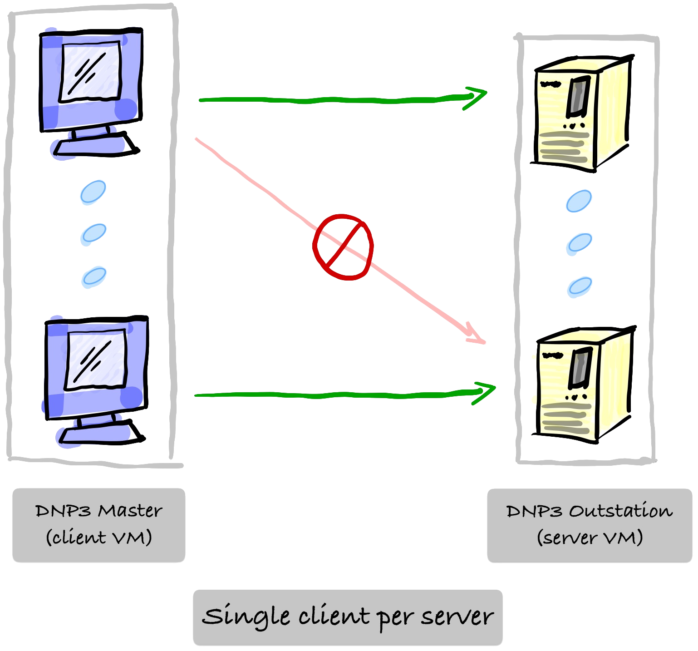

# DNP3 Module

## Configuration Example

Example section from [configuration](configuration.md) file:

```
<dnp3 name="dnp3-outstation" mode="server">
	<endpoint>127.0.0.1:20001</endpoint>
	<cold-restart-delay>15</cold-restart-delay>
	<outstation name="outstation-1">
		<local-address>10</local-address>
		<remote-address>1</remote-address>
		<warm-restart-delay>5</warm-restart-delay>
		<input type="binary">
			<address>0</address>
			<tag>line-650632.closed</tag>
			<sgvar>Group1Var1</sgvar>
			<egvar>Group2Var1</egvar>
			<class>Class1</class>
		</input>
		<output type="binary">
			<address>10</address>
			<tag>line-650632.closed</tag>
			<sgvar>Group10Var2</sgvar>
			<egvar>Group11Var2</egvar>
			<class>Class1</class>
			<sbo>false</sbo>
		</output>
		<input type="analog">
			<address>0</address>
			<tag>line-650632.kW</tag>
			<sgvar>Group30Var6</sgvar>
			<egvar>Group32Var6</egvar>
			<class>Class1</class>
		</input>
	</outstation>
</dnp3>
```

These configuration keys are described [below](#dnp3-module-overview).

## DNP3 Module Overview

The DNP3 Module can act as a DNP3 client or server. Each client can act as one or more DNP3 masters, and each server can act as one or more DNP3 outstations. A limitation is that currently, OT-sim only supports a single client connection per server. Another limitation would be support for just 32-bit analog, not 16- or 64-bit.



!!! note
    OT-sim uses OpenDNP3 v3.1.2, please visit [their content](https://dnp3.github.io/docs/guide/3.0.0/) if you have questions on the library.

### Capabilities

- Handles select before operate

- Supports class scans

- Supports unsolicited responses

- Supports outstation restarts

- Supports binary inputs and outputs

### Default Values

OT-sim supports all group and variation options that OpenDNP3 does. There are default settings if you do not specify a group and variation.

The `sgvar` key is the static group variation and has the following default values:

- Binary input is group `1` variation `2`

- Analog input is group `30` variation `6`

- Binary output is none

- Analog output is none

The `egvar` key is the event group variation and has the following default values:

- Binary input is group `2` variation `2`

- Analog input is group `32` variation `6`

- Binary output is none

- Analog output is none

Select before operate &mdash; the `sbo` key &mdash; is a binary value and it defaults to `false`.

The `class` key defaults to `Class1`; others are supported.

!!! todo
    Additional class scan rate options available in the DNP3 module need to be documented.
