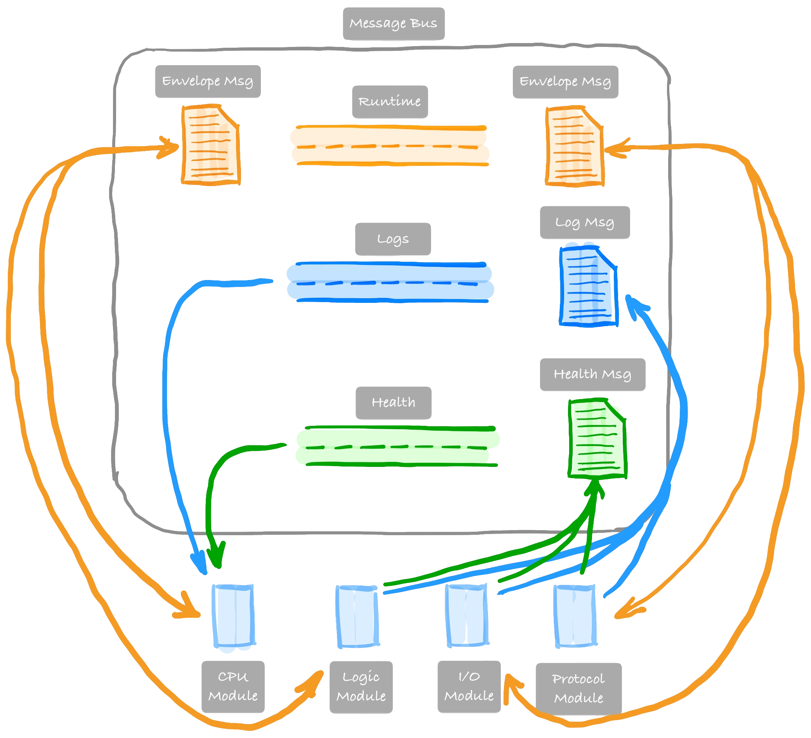

# Operational Technology (OT) Simulator

OT-sim is a set of modules that run simulated OT devices in VMs or containers. It allows researchers to represent a physical system, at scale, in a co-simulation environment for specific or system-wide testing and evaluation without impacting a real-world system. Over time, our goal is to include additional protocol support and hardware-in-the-loop capability.

!!! info "Getting Started"
    Visit [here](getting_started.md) to get started using OT-sim.

The purpose of OT-sim is to support co-simulation of OT-based modules and related infrastructure for a variety of research purposes. To that end, all of the modules run as separate processes and communicate with each other using a common message bus to make up a device. The message bus then resembles the backplane for communication from a variety of modules as seen in real-world environments. However, in OT-sim, it is the communication environment where all modules interact with the simulation environment &mdash; management signals, as well as production messages, are passed over the message bus.

!!! note
    This documentation assumes a general understanding of Operational Technology (OT) protocols and devices.

The current set of OT-sim modules are categorized as [CPU](cpu.md), protocol &mdash; [Modbus](modbus.md) and [DNP3](dnp3.md) are currently supported &mdash; [I/O](io.md) acting as a [HELICS](https://helics.org) federate, and [Logic](logic.md). OT devices can include devices such as PLCs, protection relays, IEDs, RTUs, FEPs, etc. These devices are virtual representations and “walk the walk” when it comes to protocol communication.

The [Message Bus](message_bus.md) utilizes ZeroMQ's PUB/SUB protocol to allow connected modules to publish messages for other modules to process. ZeroMQ allows the abstraction of the medium in which the message bus sends messages over, supporting IPC and Unix sockets for modules running in the same host and IP for modules running across distributed hosts. OT-sim supports a wide variety of programming languages; it is possible for modules to be written in their developer's language of choice. In addition, since each module runs as its own process, it is possible to have an OT-sim device comprised of modules written in different programming languages.

In most cases, the combination of modules formed to create an OT-sim device will all run together as separate processes on the same host &mdash; e.g., within the same VM or container. However, the design of the message bus supports modules running across multiple hosts &mdash; e.g., using an IP-based ZeroMQ socket in place of an IPC- or file-based socket.

!!! note
    A localized [configuration](configuration.md) file, in XML format, is used to describe each device.

[HELICS](https://helics.org/) is used as the primary co-simulation platform for simulating physical processes that OT-sim devices would monitor and control, so to support this the [I/O module](io.md) acts as a HELICS federate to facilitate the exchange of data with other HELICS federates. As an analogy, the data exchanged between HELICS federates can be compared to the 4-20mA current loop process control signals between sensors, actuators, and controllers in actual processes.

The [logic module](logic.md) facilitates the use of custom logic provided at runtime via the device configuration file, avoiding the need for a custom compiled modules for different logic scripts. Custom logic is a set of simple mathematical or boolean expressions that are parsed, compiled, and evaluated against variables present in the logic module or values from other modules.

The [CPU module](cpu.md) is required as part of any OT-sim device and will process the device configuration file and configure and deploy the additional modules accordingly, as well as collocate logs generated by all other modules.
